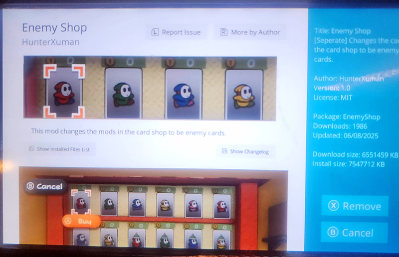
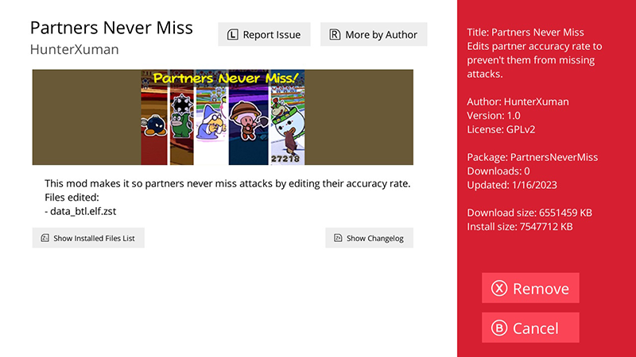
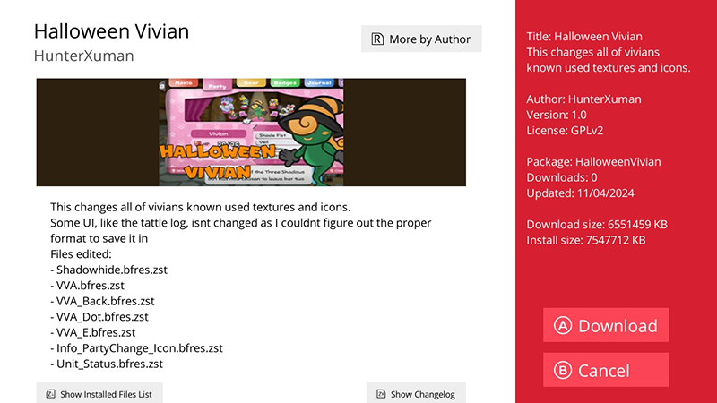

# Modern PM Modstores
An online repository of community made mods for Paper Mario Sticker Star, Color Splash, The Origami King, and The Thousand Year Door Switch. Utilizes services created and maintained by [Universal Updater](https://github.com/Universal-Team/Universal-Updater) and [Homebrew App Store](https://github.com/fortheusers/hb-appstore)

# Installation

#3DS
- You will need to install [Universal-Updater](https://github.com/Universal-Team/Universal-Updater). 
- Download Paper-Mario-3DS.unistore and Paper-Mario-3DS.t3x from the PM4 source folder and place them in sdmc:/3ds/Universal-Updater/stores on your SD card.
- In Universal Updater, open the settings tab, then go to Select Unistore and select Paper-Mario-3DS-Unistore.
- From here, you can select the mod(s) you would like to install, and follow the on screen prompts.

#Wii U
- You Will Need [SDCafiine](https://github.com/wiiu-env/sdcafiine_plugin) and the [Homebrew App Store](https://github.com/fortheusers/hb-appstore) 
- Download wiiu_KEEPMAINAPPSTORE.zip OR wiiu_MODSTOREONLY.zip from the PM5 source folder and extract it to your SD card. The wiiu_MODSTOREONLY.zip contains a new BGM.
- Currently, the json also contains the repo for the HB App Store, so mods will show alongside homebrew apps. To help make it easier to find mods, they will be located in the Games section.
- Open the HB App Store, and browse the games section. Follow the instructions for each mod as some may be standalone modpacks, or merge into a general folder

#Switch
- You Will Need [Atmosphere](https://github.com/atmosphere-nx/atmosphere/releases) and the [Homebrew App Store](https://github.com/fortheusers/hb-appstore) 
- Download switch_KEEPMAINAPPSTORE.zip OR switch_MODSTOREONLY.zip from the PM62R source folder and extract it to your SD card. The switch_MODSTOREONLY.zip contains a new BGM. (BGM Does Not Play In Applet Mode)
- The switch_KEEPMAINAPPSTORE.zip also contains the repo for the HB App Store, so mods will show alongside homebrew apps. To help make it easier to find mods, they will be located in the Games section.
- Atmosphere's layered FS does not use a standard modloader, meaning all mods will use the same folder. BE ADVISED THAT SOME MODS MAY CLASH WITH OTHERS SO PLEASE READ THEIR DESCRIPTIONS

# Submitting Your Mods To The Repo

    
#3DS

- Download the 3DS STORE ENTRY TEMPLATE.json file and the entire Icon folder from the PM4 folder in the source.
- Download the [tex3ds.exe from here](https://wii.leseratte10.de/devkitPro/other-stuff/tex3ds/tex3ds-2.3.0-4-windows_x86_64.pkg.tar.zst) and extract the archive using [7zip ZS](https://github.com/mcmilk/7-Zip-zstd/releases). It will be located in tex3ds-2.3.0-4-windows_x86_64.pkg.tar\opt\devkitpro\tools\bin\.
- Open the template file in a text editor (VSCode Highly recommended) and follow what the text says to change
- Your mod MUST be hosted somewhere that you can provide a direct download link, like dropbox, github, gamebanana etc. because thats where it will download from. A link to a page where you have to click another button to download WILL NOT WORK

- For the icon_index check the highest numbered .png file in the icons folder, and then change this number to be 1 higher than that (so if the highest number is 9.png, your new icon index should be 10)
- Design an Icon for your mod in the exact size dimension 48x48 in PNG format, and save it as the same name as the icon index you changed.
- After changing the information, save your file as NEW MOD SUBMISSION.json
- Zip your NEW MOD SUBMISSION.json and (iconindexnumber).png  and upload them to a public drive, and then [submit your request as an issue using the form, with the title being "Submission MODNAME GAMENAME" and the body having a link to your mod.](https://github.com/Hunter-Xuman/Modern-PM-Modstores/issues/new) If your mod also has a public release page (like github, gamebanana etc.) Please link that as well so it can be linked properly in the Mod List below.

    
#WiiU

- Download MOD INFO TEMPLATE.json, MOD REPO TEMPLATE.json, and MOD MANIFEST.install from the PM5 source folder
- Open each of these in a text editor (preferably VS Code) and follow the text in each to change the files. There are a few very important things.
- First, decide if you are going to make your mod supported by 1 region, or more. If 1, then you only need 1 entry in the repo template and can delete the other ones. If more than 1, then you need to keep 2 or all 3 entries. This also means you will need to create 3 INFO, 3 MANIFEST files, 3 zips of your mod, and 3 folders with images. for each region
- Second, the Manifest.install file tells the program where to place files. the common path for everyone is wiiu/sdcafiine/. After this is the title ID of the region of the game you are supporting, which is either 000500001F600A00/ for USA, 000500001F600B00/ for EUR, and 000500001F600900/ for JPN. Next you will specify what your mod folder is called. If your mod is its own standalone modpack, then you can call this whatever you want and keep it unique. If your mod is meant to be apart of a global general list of mods, then call this section Merge/. Lastly, the final part of the path is the path to where each file is supposed to go. YOU MUST list EVERY SINGLE file in your mod this way, with each on its own line. (Note. I did read there is something that can create this automatically but i dont know if its already apart of the program).

    ex:
    U: wiiu/sdcafiine/000500001F600A00/EnemyShop/content/data/fld/data_item.elf.lz
    U: wiiu/sdcafiine/000500001F600A00/EnemyShop/content/data/fld/data_shop.elf.lz

- Third, your mod must be zipped, and inside it contain a folder structure matching what you put in your manifest file. Each region zip you are creating MUST have its own info.json and manifest.install. So the root of the zip should look like this

    wiiu
    info.json
    manifest.install
- Fourth, the "name" field in the repo template is the actual name of the zip. Thats how the app will find that specific mod, so make sure they match
- Finally, to add images to your mod for the store, you need to create a folder called packages and inside that, a folder(s) matching the name of your mod.zip(s). There are 2 main images you need to create. The Icon is a 256x150 png called icon.png. The Banner is a 848x208 png called screen.png. If you want to display screenshots, these are 1920x1080 pngs that are subsequently called screen(number).png, (ex. screen1.png, screen2.png etc.)
- After editing all of that. You should be left with a folder full of things that look similar (but not exactly depending on region) to this
    packages
    repo.json
    MyMod(USA).zip
    MyMod(EUR).zip
    MyMod(JPN).zip
- Zip all of these up and upload them to a public drive, and then [submit your request as an issue using the form, with the title being "Submission MODNAME GAMENAME" and the body having a link to your mod.](https://github.com/Hunter-Xuman/Modern-PM-Modstores/issues/new) If your mod also has a public release page (like github, gamebanana etc.) Please link that as well so it can be linked properly in the Mod List below.

    
#Switch

- IF SUBMITTING A TOK MOD: Download TOK MOD INFO TEMPLATE.json, TOK MOD REPO TEMPLATE.json, and TOK MOD MANIFEST.install from the PM62R source folder
- IF SUBMITTING A TTYD MOD: Download TTYDS MOD INFO TEMPLATE.json, TTYDS MOD REPO TEMPLATE.json, and TTYDS MOD MANIFEST.install from the PM62R source folder
- After picking a game, Open the correct files in a text editor (preferably VS Code) and follow the text in each to change the files. There are a few very important things.
- First, the Manifest.install file tells the program where to place files. the common path for everyone is atmosphere/contents/0100A3900C3E2000/ for TOK mods, and atmosphere/contents/0100ECD018EBE000/ for TTYD mods. Next, the final part of the path is the path to where each file is supposed to go. YOU MUST list EVERY SINGLE file in your mod this way, with each on its own line. (Note. I did read there is something that can create this automatically but i dont know if its already apart of the program).

    TOK ex:
    U: atmosphere/contents/0100A3900C3E2000/romfs/data/data_btl.elf.zst
    U: atmosphere/contents/0100A3900C3E2000/romfs/data/data_npc.elf.zst

    TTYD ex:
    U: atmosphere/contents/0100ECD018EBE000/exefs/main.npdm
    U: atmosphere/contents/0100ECD018EBE000/exefs/subsdk9

- Third, your mod must be zipped, and inside it contain a folder structure matching what you put in your manifest file. Each mod zip for TOK AND TTYD you are creating MUST have its own info.json and manifest.install. So the root of the zip should look like this

    atmosphere
    info.json
    manifest.install
- Fourth, the "name" field in the repo template is the actual name of the zip. Thats how the app will find that specific mod. Because the app store for TOK and TTYD are shared, to make it easier for everyone to navigate, start your mod with the same prefix as you did when you edited info.json ([TOK] for TOK and [TTYD] for TTYD).
- Finally, to add images to your mod for the store, you need to create a folder called packages and inside that, a folder(s) matching the name of your mod.zip(s). There are 2 main images you need to create. The Icon is a 256x150 png called icon.png. The Banner is a 848x208 png called screen.png. If you want to display screenshots, these are 1920x1080 pngs that are subsequently called screen(number).png, (ex. screen1.png, screen2.png etc.)
- After editing all of that. You should be left with a folder full of things that look similar to this
    packages
    repo.json
    [TOK]MyMod.zip OR [TTYD]MyMod.zip
- Zip all of these up and upload them to a public drive, and then [submit your request as an issue using the form, with the title being "Submission MODNAME GAMENAME" and the body having a link to your mod.](https://github.com/Hunter-Xuman/Modern-PM-Modstores/issues/new) If your mod also has a public release page (like github, gamebanana etc.) Please link that as well so it can be linked properly in the Mod List below.

# Mod List

    
#PM4

- [PM4 Challenge Mode](https://github.com/Hunter-Xuman/PM4-Challenge-Mode) by HunterXuman and Shigu
- [Skippable Dialogue](https://gamebanana.com/mods/606337) by Inbst
- [The Cut Content Unhidden Mod](https://gamebanana.com/mods/570191) by TheIronicGaymerQween2
- [Mario Animation Revamp](https://gamebanana.com/mods/564315) by Br123TT
- [Paper Mario But Enemies Have Unreasonable Stats](https://gamebanana.com/mods/599253) by Lumdy
- [Paper Luigi Sticker Star](https://gamebanana.com/mods/581141) by dtrune
- [Origami King Mario face](https://gamebanana.com/mods/580638) by Br123TT
- [The Green Screen Battle map](https://gamebanana.com/mods/535720) by Piggreen346
- [AI Sticker Star](https://gamebanana.com/mods/392990) by Mayro
- [Royal Sticker Boss Defense Removal Mod](https://gamebanana.com/mods/459482) by HunterXuman
- [Old damage animation](https://gamebanana.com/mods/533877) by Br123TT
- [Red and Blue 5 and 10 Coins](https://gamebanana.com/mods/525406) by HunterXuman
- [Ooooo (Kersti Mod)](https://gamebanana.com/mods/611770) by Piggreen346
- [Kurt Angle Stare Goomba Boss](https://gamebanana.com/mods/502084) by Piggreen346
- [Cursed BattleMap Snow](https://gamebanana.com/mods/482091) by Piggreen346
- [Retro Goomba](https://gamebanana.com/mods/479127) by Piggreen346
- [The Green Screen Battle map](https://gamebanana.com/mods/535720) by Piggreen346
- [Skip The Intro](https://gamebanana.com/mods/643395) by Shigu
- [Rogueport Town Theme over Decalburg](https://gamebanana.com/sounds/65374) by HunterXuman
- [Every Paper Mario Title Theme](https://gamebanana.com/sounds/77207) by Sonic Gamer
- [March Ahead (Paper Mario 64) over Grassland Theme](https://gamebanana.com/sounds/65399) by Reecee_yt
- [TTYD Battle Theme over Normal Battle Theme](https://gamebanana.com/sounds/65400) by Reecee_yt

    
#PM5

- Enemy Shop by HunterXuman
- [Ooooo Over Huey](https://gamebanana.com/mods/611969) by Piggreen346

    
#PM6

- [Partners Never Miss](https://gamebanana.com/mods/422697) by HunterXuman

    
#PM2R

- [Halloween Vivian](https://gamebanana.com/mods/552669) by HunterXuman
- [Loading Zone Randomizer](https://gamebanana.com/mods/587002) by CaXaP

# Helpful Resources

For additional help and resources for making and using mods, visit the [Paper Mario Technical Knowledge Base](https://papermariotkb.wiki.gg/wiki/Paper_Mario_Technical_Knowledge_Base) for general game and modding information.
For community support, join the [Modern PM Modding Discord Server](https://discord.gg/9EzRrfVfPg).

# Credits and Donations
[HunterXuman](https://ko-fi.com/hunterxuman) - Project Lead Dev 
Flare - Store Additions
